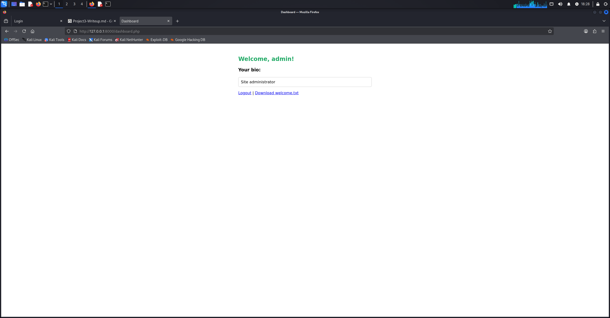
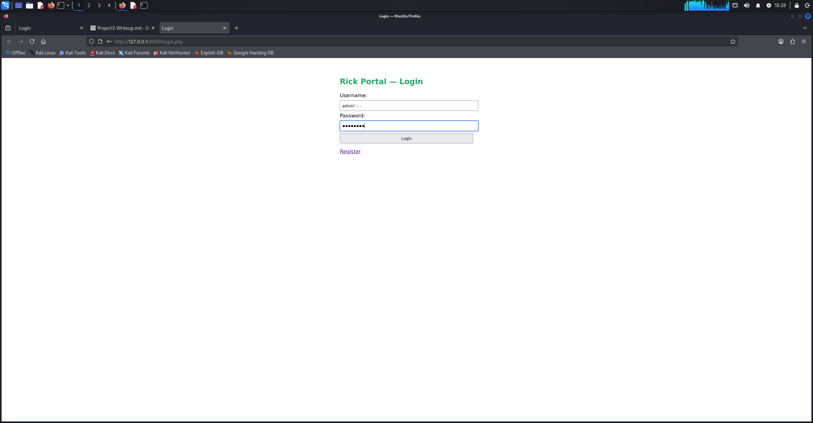
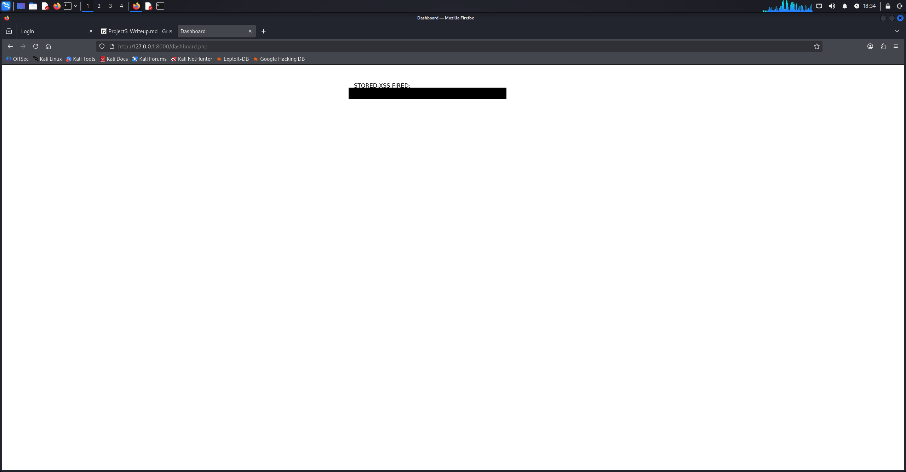
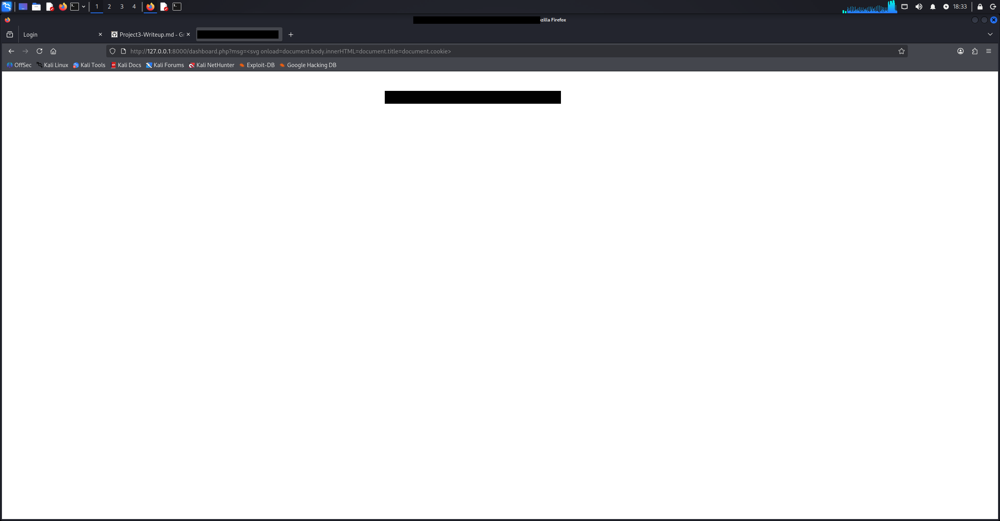
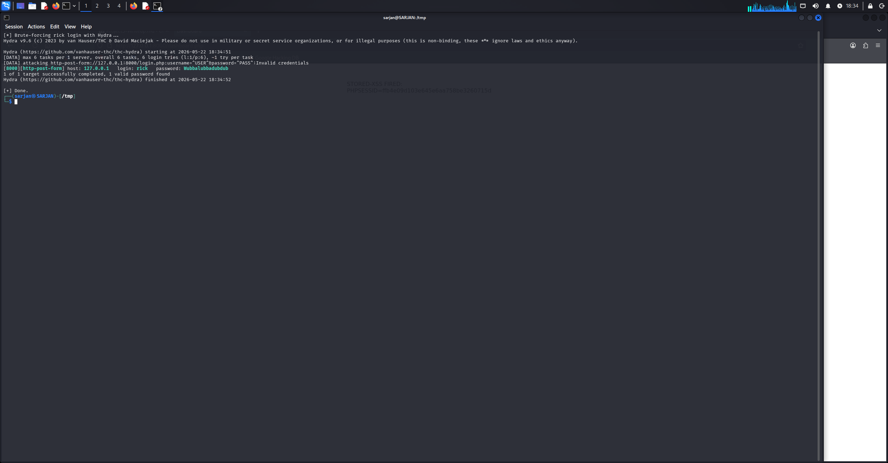
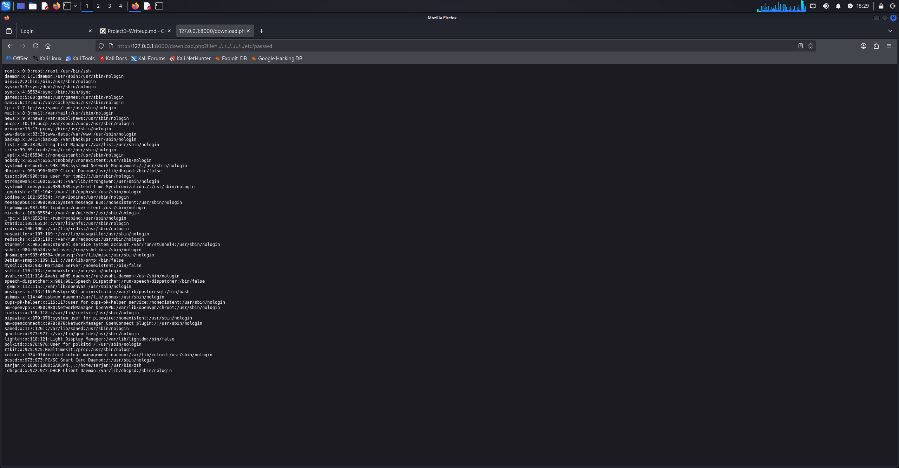
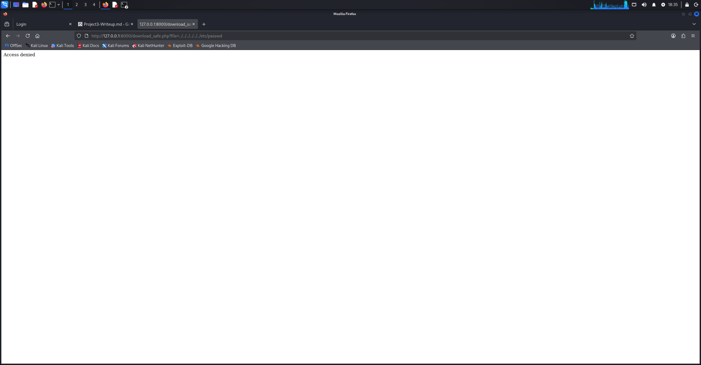
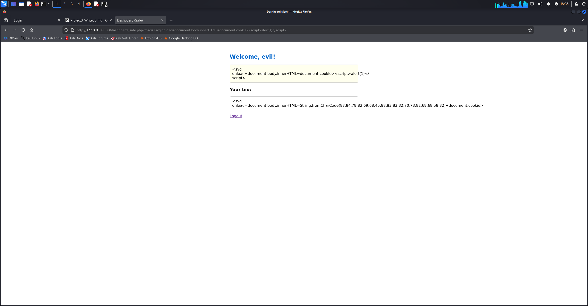

# Vulnerable Web App — Attack & Defend Lab

A deliberately-vulnerable PHP login application built to demonstrate **5 common web
vulnerabilities** and the **fix for each**. Educational project — shows both offensive
(finding bugs) and defensive (fixing them) skills.

> ⚠️ **For learning only.** This app is intentionally insecure. Run it **locally**
> (`127.0.0.1`) and never expose it to a public network.

## Stack
- PHP (built-in dev server) · MariaDB · Linux
- Tested with: `curl`, `hydra`

## Setup
```bash
# 1. Database (MariaDB running)
sudo mysql < setup.sql        # or run the CREATE/INSERT statements manually

# 2. Serve the app
cd vulnapp
php -S 127.0.0.1:8000

# 3. Open in a browser
#    http://127.0.0.1:8000/login.php
```
Seeded test users live in the `users` table (passwords are plaintext **on purpose** —
fixed in the hardened version with `password_hash()`).

## Vulnerabilities & Fixes

| # | Vulnerability | Vulnerable file | Fix | Hardened file |
|---|---------------|-----------------|-----|---------------|
| 1 | SQL Injection | `login.php` | Prepared statements | `login_safe.php` |
| 2 | Stored XSS | `register.php` → `dashboard.php` | Output encoding (`htmlspecialchars`) | `dashboard_safe.php` |
| 3 | Reflected XSS | `dashboard.php` (`?msg=`) | Output encoding | `dashboard_safe.php` |
| 4 | Brute Force | `login.php` | Rate limiting + lockout | `login_safe.php` |
| 5 | Directory Traversal | `download.php` | `basename()` + `realpath()` validation | `download_safe.php` |

Apache hardening (`-Indexes`, block sensitive files) is in `.htaccess`.

## Quick demo of each attack
```text
SQLi:      login with username  admin'-- -   and any password
Stored XSS: register a user whose bio is  <script>alert(document.cookie)</script>
Reflected:  /dashboard.php?msg=<script>alert('x')</script>
Brute force: hydra -l rick -P wordlist 127.0.0.1 -s 8000 http-post-form \
             "/login.php:username=^USER^&password=^PASS^:Invalid credentials" -f
Traversal:  /download.php?file=../../../../etc/passwd
```
Compare each against the `*_safe.php` version to see it blocked.

## 📸 Proof (Screenshots)

The five attacks demonstrated, and the hardened versions blocking them:

**1 · SQL Injection**



**2 · Stored XSS**


**3 · Reflected XSS**


**4 · Brute Force**


**5 · Directory Traversal**


**Hardened fixes blocking the attacks**



## File structure
```
vulnapp/
├── config.php / db.php          # config + DB connection
├── login.php / login_safe.php
├── register.php / register_safe.php
├── dashboard.php / dashboard_safe.php
├── download.php / download_safe.php
├── logout.php
├── .htaccess                    # Apache hardening
├── files/        welcome.txt    # public download
├── private/      secret.txt     # traversal demo target
└── screenshots/                 # proof images
```

See **`./Project3-Writeup.md`** for the full step-by-step attack/fix walkthrough with results.

## Known limitation
The brute-force lockout is **session-based**, so a cookie-discarding attacker can bypass it.
Production-grade defense tracks failures **server-side by IP + username** (or adds CAPTCHA /
exponential backoff).
